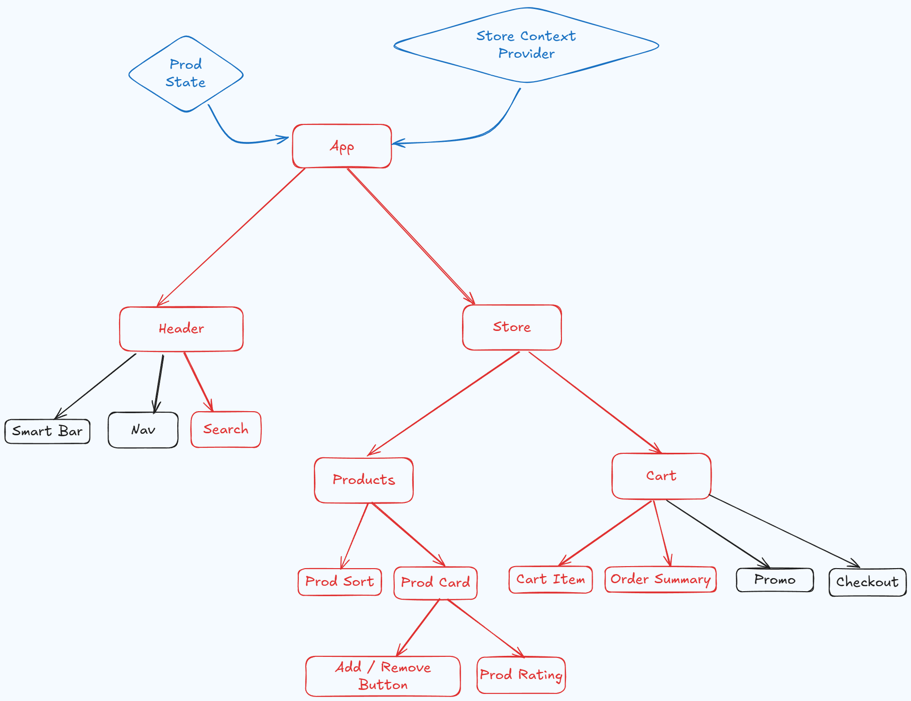

# Project - LWS Shop

## Overview

The project demonstrates core React concepts such as state management with `useReducer` and `Context`.

## Learning Objective

- To understand the concept and uses cases of managing state globally using Context API and useReducer hook.
- Managing state from a single location (context)
- Managing all the cart events from a single state

## Requirements

- Display products in grid from saved Data
- User can add / remove products to cart
- Clicking plus and minus in the cart allows to change data in the state
- Order summary state updates on cart state changes
- User can search and sort products which displayes filtered products from the state

## Methodology

- **React**
- **State Management:** `useReducer` and `prop drilling`
- **Context:** `useContext`

**Not Allowed**: useEffect, external package manager, memo

## Mind Map

